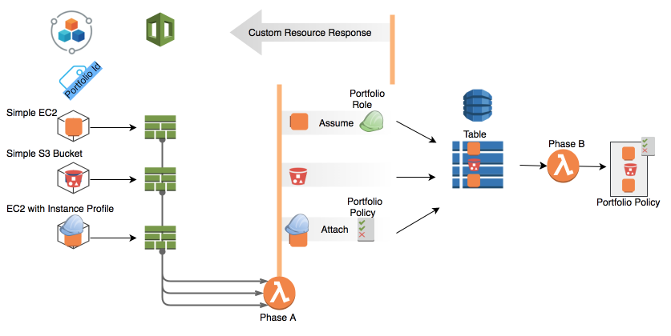

# Create a security partition for your applications using AWS Service Catalog and AWS Lambda
The repository includes python3 AWS Lambda function code and a CFN template to deploy the security partition solution.
The AWS Lambda function automates the application infrastructure separation for each application that is provisioned via AWS Service Catalog portfolio.
Application related resources will be able to communicate using AWS API calls, between themselves, while being banned to
issue AWS API calls to resources out of the application scope.
To learn more you can read [the blog post](https://amazon.awsapps.com/workdocs/index.html#/document/d00c450786d13834a4266ebd074fdafd04486a3c3b2f4381030ddc8c06e4fbea).


## Architecture and Flow
As a service catalog product is launched, CloudFormation stack is created based on the product’s CloudFormation template.
Once all the resources are provisioned a final custom resource will invoke the “phase a” lambda function to execute the logic of the security partition.
Phase A lambda inquires for the provisioned resources and their provisioning status. 
For each resource it calls “assume role” with the portfolio role. If the resource already assumes a role, it attaches the portfolio policy to that role. 
Finally, it updates the DynamoDB table with new items which includes portfolio id and resource arn. Once it ends, the lambda sends response to CloudFormation in order to finalize the provisioning process.
When the DynamoDB table is updated, DynamoDB stream invokes the “phase b” lambda function. 
The latter creates new Portfolio Policy version, according to the current information in the table, and set it to be the default version.



Currently, the solution supports a limited set of resource types:
   - "AWS::EC2::Instance"
   - "AWS::Lambda::Function"
   - "AWS::DynamoDB::Table"
   - "AWS::S3::Bucket"
   
See instructions for adding support for other resource types [Adding support for new resource types](docs/support_new_resource_type.md)

## Deploy
Use the CloudFormation template to deploy the required AWS resources:
- AWS DynamoDB table
- AWS Lambda Function triggered by DynamoDB Stream
- AWS Lambda Function triggered by CFN custom resource


1. Clone Aws-service-catalog-portfolio-partition repository
1. Package the lambda functions code ([see documentation for creating lambda package](https://docs.aws.amazon.com/lambda/latest/dg/lambda-python-how-to-create-deployment-package.html)) and upload the resulted zip file to a S3 bucket.
    ```bash
    cd Aws-service-catalog-portfolio-partition/code/
    zip -r ../code.zip .
    aws s3 cp ../code.zip s3://<Bucket Name>/
    ```
1. Use either the [AWS console](https://console.aws.amazon.com/cloudformation/home?region=us-east-1#/stacks/new?stackName=sc-portfolio-partition&templateURL=https://s3.amazonaws.com/blog-service-catalog-security-partition-may1st2018/template.yml) or aws cli to create stack with the CloudFormation template. 
Find the CloudFormation template, template.yml, under the deployment folder.
When creating the stack, supply the S3 bucket name and S3 key name of the Lambda functions package. 
    ```bash
    cd Aws-service-catalog-portfolio-partition/deployment/
    aws cloudformation create-stack --stack-name sc-security-partition --template-body file://template.yml --parameters ParameterKey=LambdaCodeS3Bucket,ParameterValue=<BucketName> ParameterKey=LambdaCodeS3Key,ParameterValue=<KeyName>  --capabilities CAPABILITY_IAM
    ```
    This template will provision 2 Lambda Functions and a DynamoDB Table. The ARN of the “phase a” lambda function will be exported to be consumed by the SetSecurityPartition custom resource.
    ```yaml
    AWSTemplateFormatVersion: '2010-09-09'

    Description: Create all prerequisites for the portfolio security partition solution.

    Parameters:
      LambdaCodeS3Bucket:
        Description: S3 Bucket Name in which the lambda package stored
        Type: String
      LambdaCodeS3Key:
        Description: S3 Bucket Key of the stored lambda package
        Type: String

    Outputs:
      PartitionPhaseAFunctionArn:
        Description: Lambda function to serve the custom resource of portfolio as security partition
        Value: !GetAtt PartitionPhaseAFunction.Arn
        Export:
          Name: PartitionPhaseAFunctionArn

    Resources:
      PartitionPhaseAFunction:
        Type: 'AWS::Lambda::Function'
        Properties:
          Description: 'The first of two lambda functions that applies a security partition
           around resources which have originated in the same Service Catalog Portfolio'
      LambdaPhaseARole:
        Type: 'AWS::IAM::Role'
      PartitionPhaseBFunction:
        Type: 'AWS::Lambda::Function'
        Properties:
          Description: 'The second of two lambda functions that applies a security partition
           around resources which have originated in the same Service Catalog Portfolio'
      PolicyTable:
        Type: 'AWS::DynamoDB::Table'
      PolicyTableEventStream:
        Type: "AWS::Lambda::EventSourceMapping"
            EventSourceArn: !GetAtt PolicyTable.StreamArn
            FunctionName: !GetAtt PartitionPhaseBFunction.Arn
    ```
## Portfolios and Products Onboarding
To apply the security partition on a new created portfolio, you will have to add a tag option to it and to revise your products to include the SetSecurityPartition custom resource.
1. Add tag option to the portfolio:
    ```bash
    name=<NAME>
    portfolioid=`aws servicecatalog list-portfolios --output text --query "PortfolioDetails[?DisplayName=='$name'].Id|[0]"`
    tagid=`aws servicecatalog create-tag-option --key PortfolioId --value $portfolioid --output text --query "TagOptionDetail.Id"`
    aws servicecatalog associate-tag-option-with-resource --resource-id $portfolioid --tag-option-id $tagid 
    ```
    Be sure to replace the \<NAME\> with your portfolio name.
1. For each product associated with the portfolio, its CloudFormation template should be modified to include the custom resource in the following format:
    ```yaml
    SetSecurityPartition:
       Type: Custom::SetSecurityPartition
       DependsOn: <List of all the Logical Resources Names provisioned in this template>
       Properties:
         ServiceToken: !ImportValue PartitionPhaseAFunctionArn
    ```
    Note that the **DependsOn** attribute should include the logical name of the resources, such that the custom resource will be the last to be provisioned. 
## Customize the Security Partition
For additional control when you define the security partition, the permitted actions per resource type, within the Portfolio Policy, are configurable. For that we use configuration file which is located under Aws-service-catalog-portfolio-partition/code/configuration/resource_types_actions_allowed.json
Allowed actions per resource type:
```json
{
 "AWS::EC2::Instance": ["ec2:Describe*"],
 "AWS::Lambda::Function": ["lambda:*"]
}
```
For a resource type not listed, the default value will be "\*".

## Supported Resource Types
When it comes to IAM, each AWS resource type might have a different behavior. Moreover, there are resource types which are actively accessing other resources and thus might assume roles (e.g., ec2 instance, lambda function) while others are more passive (e.g., s3, dynamoDB). To handle the different resources, the portfolio security partition implementation maintain a whitelist of supported resource types. In addition, to be supported, each resource type must implement the resources/base.py interface.
Please find detailed instructions in the git repository documentation. 
Once a new resource type is whitelisted and has an implemented object, the lambda functions permissions must be updated to be allowed with the new required actions. Those actions may be concluded from the api calls been used within the new implemented object.
Following are the current supported resource types:
```json
"AWS::EC2::Instance",
"AWS::Lambda::Function",
"AWS::DynamoDB::Table",
"AWS::S3::Bucket"
```

## License Summary

This sample code is made available under a modified MIT license. See the LICENSE file.
