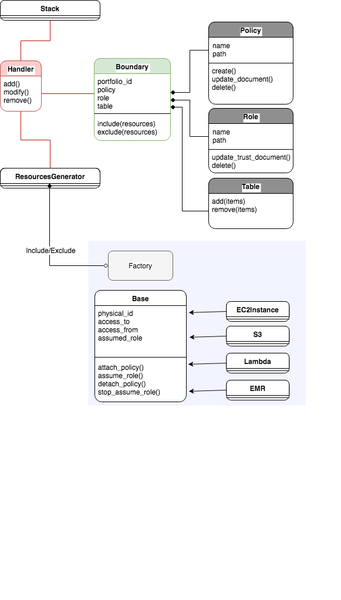

# Lambda Function Implementation
The following schema describes the main objects within the lambda package.
The Handler is triggered by the event, which originated at the custom resource within the cloudformation template.
Using the stack id, derived from the event, the Handler instantiate a Stack object to conclude the provisioned resources and the originating portfolio (using the tag option PortfolioId which is associated with the stack).
Once concluding the relevant resources, using the ResourcesGenerator, the Handler instantiates the Boundary which is defined by the context: portfolio_id.
The context identified by the portfolio_id is associated with specific dedicated controllers: Policy, Role, Table. 
The Boundary includes/excludes the resources using the resource generator to get the appropriate object type for each resource type.

